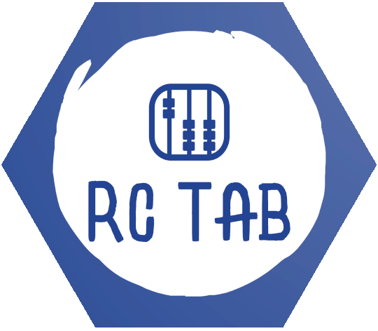

# RCTab

An Azure subscription management, reporting, and usage monitoring system created by The Alan Turing Institute.

You will find the online documentation [here](https://rctab.readthedocs.io/en/latest/) and the documentation source code in [docs/](docs/).

## Source Code

The source code for RCTab is contained in five repositories:

- The [CLI](https://github.com/alan-turing-institute/rctab-cli) repository contains the command-line interface (used for administrative tasks), which is a Pip-installable Python package.
- The [Infrastructure](https://github.com/alan-turing-institute/rctab-infrastructure) repository contains code for automated deployment with [Pulumi](https://www.pulumi.com/).
- The [API](https://github.com/alan-turing-institute/rctab-api) repository has code for the webserver, which is pushed [to DockerHub](https://hub.docker.com/r/turingrc/rctab-api) each time there is a new release.
- The [Functions](https://github.com/alan-turing-institute/rctab-functions) repository contains three Azure function apps, which are also pushed to DockerHub ([usage](https://hub.docker.com/r/turingrc/rctab-usage), [status](https://hub.docker.com/r/turingrc/rctab-status), and [controller](https://hub.docker.com/r/turingrc/rctab-controller)) each release.
- The [FastApiMsal](https://github.com/alan-turing-institute/fastapimsal) repository provides integration for Microsoft Entra ID (formerly Azure AD) within FastAPI applications.
- The [rctab-models](https://github.com/alan-turing-institute/rctab-models) repository contains [pydantic](https://docs.pydantic.dev/latest/) models that are used by the server and client components.

## Contact Information

If you need to get in touch with us, please open an issue on GitHub. See also [CONTRIBUTING.md](CONTRIBUTING.md).

## Contributors

<table>
  <tbody>
    <tr>
      <td align="center" valign="top" width="14.28%"><a href="https://github.com/OscartGiles"> <b>Oscar T Giles</b></a> Original project author, responsible for the initial design and implementation of the API and CLI.</td>
      <td align="center" valign="top" width="14.28%"><a href="https://github.com/Iain-S"> <b>Iain Stenson</b></a> Added the function apps and newer features of the API and CLI.</td>
      <td align="center" valign="top" width="14.28%"><a href="https://github.com/tomaslaz"> <b>Tomas Lazauskas</b></a> Initial concept, contributed to the API codebase and database, overall project guidance and support.</td>
      <td align="center" valign="top" width="14.28%"><a href="https://github.com/joseph-palmer"> <b>Joseph Palmer</b></a> Refined the automated deployment and front-end details pages.</td>
      <td align="center" valign="top" width="14.28%"><a href="https://github.com/pwochner"> <b>Pamela Wochner</b></a> Added summary emails and prepared the project for open-source.</td>
    </tr>
    <tr>
      <td align="center" valign="top" width="14.28%"><a href="https://github.com/dlpbc"> <b>Eseoghene Benjamin</b></a> Provided code review, contributions, and feedback on documentation.</td>
      <td align="center" valign="top" width="14.28%"><a href="https://github.com/mhauru"> <b>Markus Hauru</b></a> Acknowledged for code and documentation contributions.</td>
      <td align="center" valign="top" width="14.28%"><a href="https://github.com/JimMadge"> <b>Jim Madge</b></a> Acknowledged for code and documentation contributions.</td>
      <td align="center" valign="top" width="14.28%"><a href="https://github.com/fedenanni"> <b>Federico Nanni</b></a> Acknowledged for code and documentation contributions.</td>
    </tr>
  </tbody>
</table>

## Licence

RCTab is released under an MIT licence. See [LICENSE](LICENSE).

## Acknowledgements

This work was supported in part through computational resources provided by The Alan Turing Institute under **EPSRC grant EP/N510129/1** and with the help of a generous gift from Microsoft Corporation.

## ⚠️  Disclaimer

The Alan Turing Institute and its group companies ("we", "us", the "Turing") make no representations, warranties, or guarantees, express or implied, regarding the information contained in this repository, including but not limited to information about the use or deployment of the RCTab and/or related materials.
We expressly exclude any implied warranties or representations whatsoever including without limitation regarding the use of the RCTab and related materials for any particular purpose.
The RCTab and related materials are provided on an 'as is' and 'as available' basis and you use them at your own cost and risk.
To the fullest extent permitted by law, the Turing excludes any liability arising from your use of or inability to use this repository, any of the information or materials contained on it, and/or the RCTab.

Deployments of the RCTab code and/or related materials depend on their specific implementation into different environments and we cannot account for all of these variations.
Safe use of any RCTab code or materials also relies upon individuals' and their organisations' good and responsible data handling processes and protocols and we make no representations and give no guarantees regarding the safety, security or suitability of any instance(s) of the deployment of the RCTab.
The Turing assumes no responsibility for updating any of the content in this repository; however, the underlying code and related materials may change from time to time with updates and it is the user's responsibility to keep abreast of these updates.
