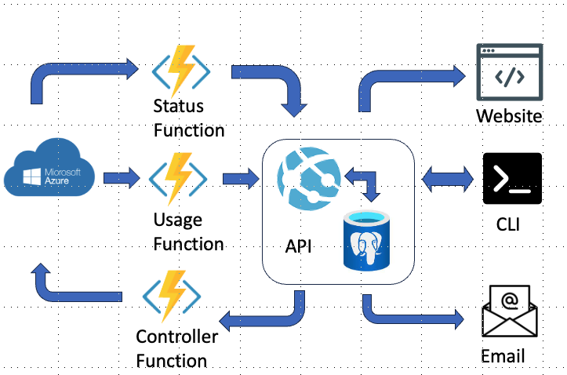
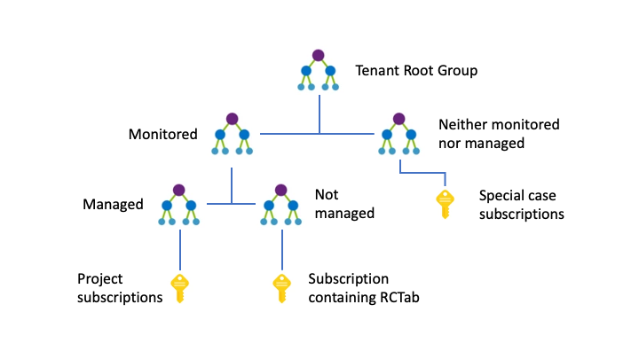

## Summary

The advent of commercial cloud services has provided researchers with the benefits of flexible and scalable computing and storage resources. Unfortunately, cloud providers do not always provide the ability to enforce strict budget controls, allowing users to overspend. This can present serious challenges for adoption in research organisations that need to centrally disseminate cloud resources to researchers with independent budgets. In response, we have developed [RCTab](https://rctab.readthedocs.io/) (**R**esearch **C**omputing **Tab**les), an open-source system for budget control and [subscription](https://learn.microsoft.com/en-us/azure/cloud-adoption-framework/ready/azure-setup-guide/organize-resources#management-levels-and-hierarchy) management. RCTab enables organisations to centrally manage cloud resources while enforcing strict budget controls. Organisations can allocate budgets, and RCTab will automatically monitor usage and shut down cloud resources when it is consumed. It enables users to monitor their budget usage via a web interface and email alert system. RCTab is designed to be customisable and extensible, is written in Python and can be easily deployed using infrastructure as code tools. 

## Statement of Need

Institutions are adopting cloud platforms, such as Amazon Web Services, Microsoft Azure and Google Cloud Platform, for their operational and research computing infrastructure.
However, on-demand pricing can present challenges for organisations that require certainty in their expenditure.
This is especially true for organisations with technical users, who require both autonomy and access to the latest hardware, such as multi-GPU virtual machines.
The limitations of budget monitoring and enforcing tools can require organisations to either limit the number of users accessing resources and the type of resources they can access or employ dedicated staff to monitor resource usage and costs.
Neither approach is ideal: the former can restrict the cloud's potential, while the latter is time-consuming and error-prone.

Microsoft Azure, which is the focus of this work, offers tools for managing costs, such as [budgets](https://docs.microsoft.com/en-us/azure/cost-management-billing/costs/tutorial-acm-create-budgets), [cost alerts](https://learn.microsoft.com/en-us/azure/cost-management-billing/costs/cost-mgt-alerts-monitor-usage-spending), and [cost analysis](https://learn.microsoft.com/en-us/azure/cost-management-billing/costs/quick-acm-cost-analysis).
These tools are designed for individual subscriptions, and they do not scale effectively for organisations with many subscriptions.
Moreover, they do not offer a mechanism to impose strict limits on spending or specify the duration for which a budget is valid.

Our response to this challenge is the development of [RCTab](https://rctab.readthedocs.io/), an open-source system for automating the management of subscriptions on Azure.

RCTab has been developed by the Alan Turing Institute's Research Computing team and is used at the Institute to oversee hundreds of subscriptions used by researchers and support staff with plans to expand its use to other organisations and cloud providers.

## Codebase

The source code for RCTab is contained in five repositories:

- the [CLI](https://github.com/alan-turing-institute/rctab-cli) repository contains the command-line interface (used for administrative tasks), which is a Pip-installable Python package.
- the [Infrastructure](https://github.com/alan-turing-institute/rctab-infrastructure) repository contains code for automated deployment with [Pulumi](https://www.pulumi.com/).
- the [API](https://github.com/alan-turing-institute/rctab-api) repository has code for the webserver, which is pushed [to DockerHub](https://hub.docker.com/r/turingrc/rctab-api) each time there is a new release.
- the [Functions](https://github.com/alan-turing-institute/rctab-functions) repository contains three Azure function apps, which are also pushed to DockerHub ([usage](https://hub.docker.com/r/turingrc/rctab-usage), [status](https://hub.docker.com/r/turingrc/rctab-status) and [controller](https://hub.docker.com/r/turingrc/rctab-controller)) each release.
- the [eponymous repository](https://github.com/alan-turing-institute/rctab) houses the general documentation (the other repositories also have sites for component-specific documentation).

Detailed instructions on how to deploy RCTab to Azure with Pulumi can be found in the docs for the Infrastructure repository.
Once Pulumi has been installed and the necessary settings have been configured, an instance of RCTab can be deployed or destroyed in minutes.
Additional instances (e.g. for testing) can also be created quickly.

## Operation

Once deployed to Azure, an instance of RCTab will comprise:

- A FastAPI web server, which uses the API Docker image.
  This allows users to view budgets, Role-Based Access Control (RBAC) assignments and the state of subscriptions.
- Three function apps, running their respective Docker images, that collect data and enable/disable subscriptions.
- A PostgreSQL database.
- Logging and alerts.

Users can use the web frontend to see subscriptions' spending and budget details, such as remaining amount, expiration date, the project to which spending will be charged and list of RBAC assignments.

Administrators can use the CLI to create and edit budgets, override budgets (for critical subscriptions that must never be turned off) and get summaries.

RCTab integrates with Microsoft Entra ID (previously "Azure Active Directory") to provide "Single Sign On" authentication for the frontend and CLI.

The Usage and Status functions run on a schedule to collect information about subscriptions' recent spending and current state, respectively, and post it to the web server.

The Controller function will poll the web server to see whether any subscriptions need to be turned off or on.

The web server will email users about changes to their subscriptions and send daily email summaries to administrators.

## Lifecycle of a Subscription

A simple method for organising an Azure tenant is to create one subscription per project (or per-group or per-department, etc).
RBAC assignments can be used to grant permissions to researchers at the subscription level, giving them the freedom to create, modify and delete resources within that subscription as their work requires.

Once a subscription has been created, it will need to be placed into a management group so that RCTab can monitor it.
RCTab will have been given control over a management group during setup.

Using the CLI, an administrator can add an "approval" for the subscription to RCTab that specifies the amount and duration of the budget for the subscription.

When the subscription approaches its budget or expiration date, RCTab will email users with role assignments to give them a chance to request a budget increase or an extension.

If this is granted, the admin can extend the approval with the CLI.
The approval has fields to link to the email or support request used to request the extension.

If the request is denied, the subscription will be disabled by RCTab and, again, users will be notified by email.
Azure will permanently delete the subscription after approximately 90 days, though the subscription can be re-activated up until that point.

## Acknowledgements

- This work was supported in part through computational resources provided by The Alan Turing Institute under EPSRC grant EP/N510129/1 and with the help of a generous gift from Microsoft Corporation.
- Oscar Giles is the original project author, responsible for initial design and implementation of the API and CLI.
- Iain Stenson added the function apps and newer features of the API and CLI.
- Tomas Lazauskas provided guidance and support for the project, as well as contributions to the API codebase.
- Joseph Palmer refined the automated deployment and the front-end details pages, amongst other work.
- Pamela Wochner added summary emails, as well as work on preparations for making the project open-source.
- In addition to code review and contributions, Eseoghene Ben-Iwhiwhu provided feedback on the documentation.
- We would like to acknowledge code and documentation contributions by Markus Hauru, Jim Madge and Federico Nanni.
